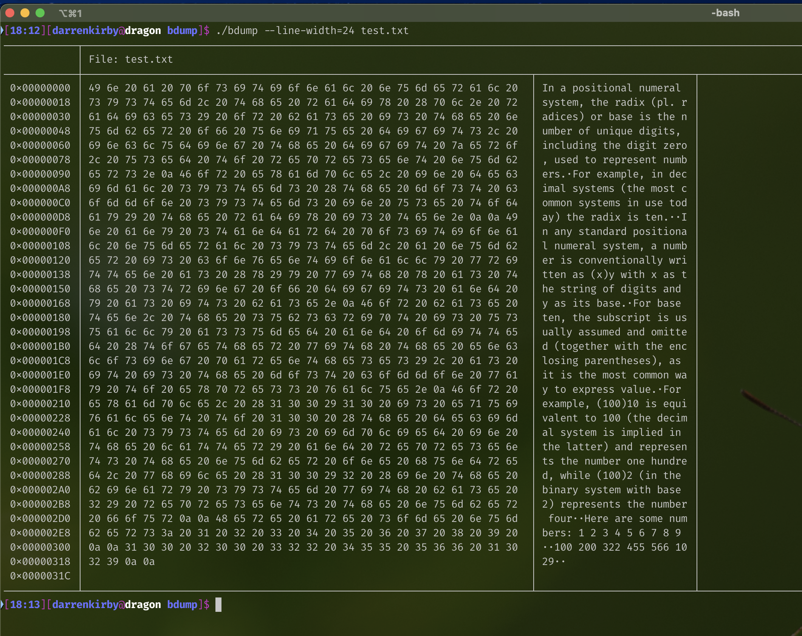
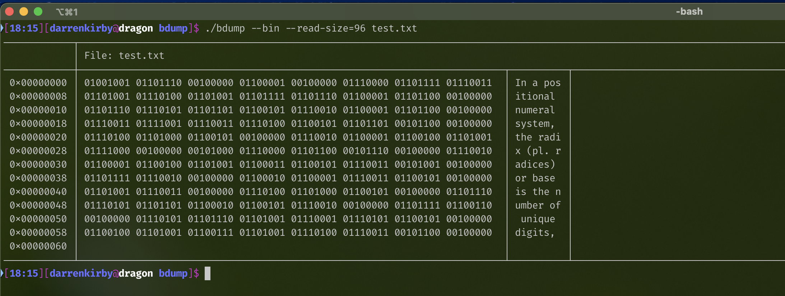
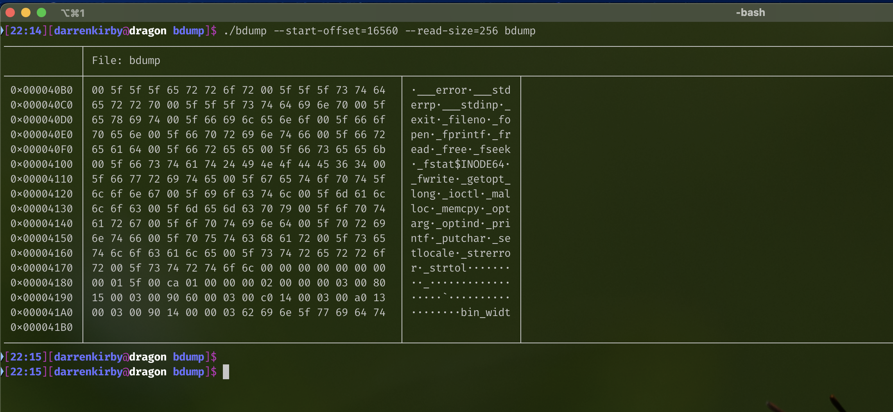

# bdump

A modern-ish remake of `od`, `hexdump`, `xxd`, and similar byte-dumping utilities. The look and feel is largely inspired by 
[bat](https://github.com/sharkdp/bat).








## Synopsis

```text
bdump [-xodbhV] [-s N] [-r N] [-l N] [FILE]
```

If `FILE` is omitted, input is read from standard input.

## Description

`bdump` prints unambiguous representations of individual bytes, along with a textual representation of bytes that fall within the printable ASCII range.

Input may be provided either as a filename argument or via standard input. See the **Bugs** section for important differences between regular files and piped input.

Output is divided into four logical sections using Unicode box-drawing characters:

### Banner

The banner currently displays the name of the file being dumped.

### Offset Well

A fixed-width column displaying the starting offset of each output line.

Offsets are displayed using the currently selected output format. By default, this is hexadecimal. The final line contains the total size of the dumped file.

### Data Dump

The main output area containing the byte values.

The default format is unsigned hexadecimal, but output may also be displayed as:

* Unsigned octal
* Unsigned decimal
* Unsigned binary

Changing the output radix also changes the offset format, except when binary output is selected. In binary mode, offsets continue to be displayed in hexadecimal.

### ASCII Dump

Displays printable ASCII characters directly.

Bytes outside the printable ASCII range are shown as the Unicode middle dot character (`·`, U+00B7).

### Line Width

The number of bytes displayed per row can be controlled with the `--line-width` option.

The default width is 16 bytes.

Regardless of line width, each output row contains:

1. The offset of the first byte on the line
2. The byte values in the selected format
3. The printable ASCII representation of those same bytes

## Options

### `-h`, `--help`

Display usage information.

### `-V`, `--version`

Display version information.

### `-x`, `--hex`

Display output in hexadecimal format.

This is the default.

### `-o`, `--oct`

Display output in octal format.

### `-d`, `--dec`

Display output in unsigned decimal format.

### `-b`, `--bin`

Display output as binary bit strings.

Offsets remain displayed in hexadecimal.

### `-l N`, `--line-width=N`

Display `N` bytes per output row.

The value is capped at 255. In practice, values larger than roughly 48 may become difficult to read depending on terminal width.

### `-s N`, `--start-offset=N`

Begin dumping at byte offset `N`.

In other words, skip the first `N` bytes of input.

### `-r N`, `--read-size=N`

Stop after reading `N` bytes.

This option may be combined with `--start-offset` to dump arbitrary slices of a file.

## Bugs

The `--start-offset` option works correctly when reading from a regular file or from redirected standard input:

```bash
bdump -s 100 myfile.bin
bdump -s 100 < myfile.bin
```

However, data arriving through a pipe cannot be repositioned with `fseek()`:

```bash
cat myfile.bin | bdump -s 100
```

In this situation, `fseek()` will fail and print an error message. The offset is then reset to zero and dumping proceeds from the beginning of the stream.

This limitation is inherent to non-seekable input streams such as pipes and sockets.

Additionally, while you can start `bdump` with no FILE arguments or redirects to input data directly from the keyboard, due to 
the internal buffer nothing will be output until an entire line of data has been entered (by default 16 bytes, but configurable
via `--line-width`), or by sending an EOF character by using `ctrl+d`.

## Author

Darren Kirby [darren@dragonbyte.ca](mailto:darren@dragonbyte.ca)

## See Also

* `od(1)`
* `hexdump(1)`
* `xxd(1)`
